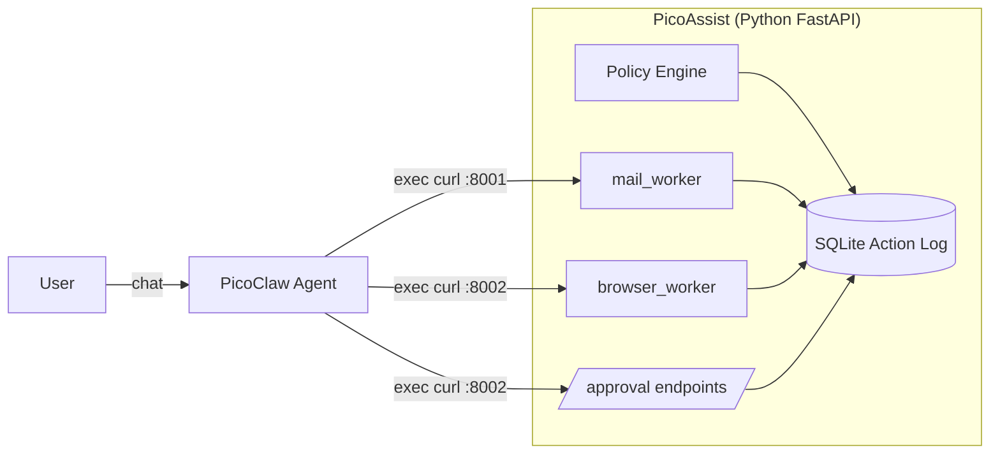
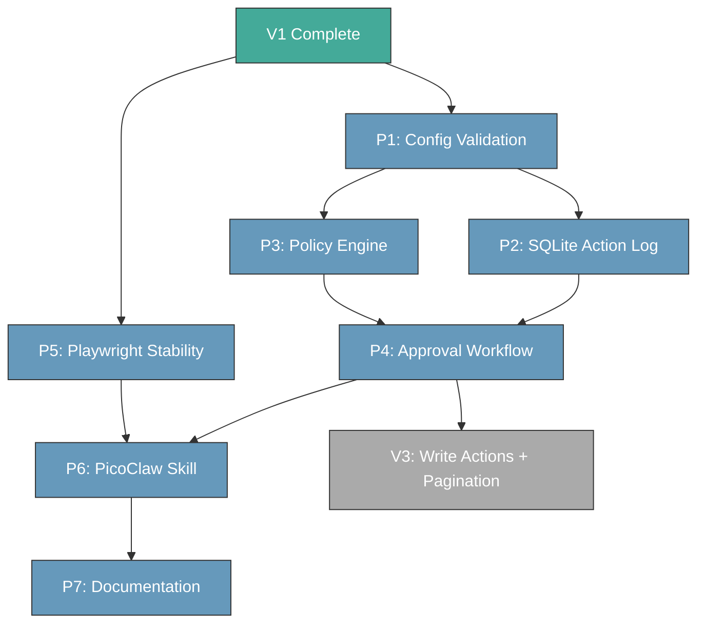
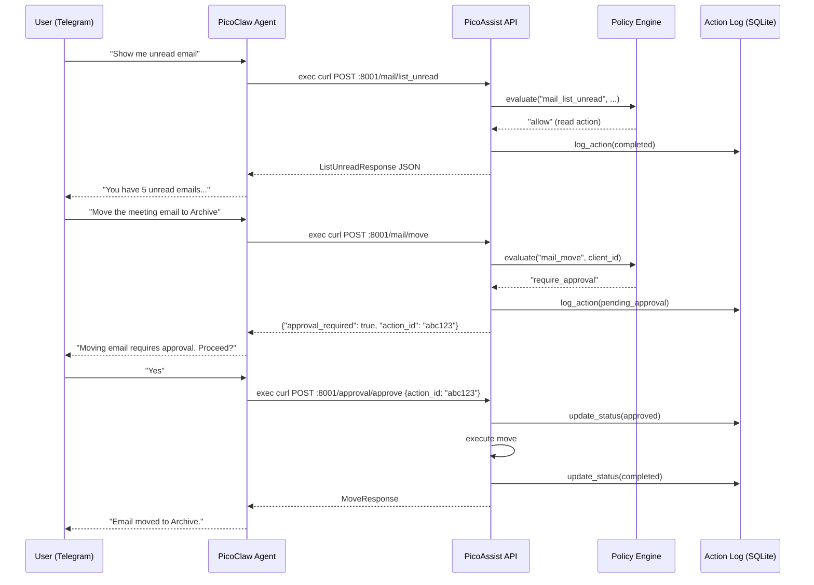

# V2 Implementation Plan — Overview

> **Prerequisite:** V1 is complete. See `docs/V1-IMPLEMENTATION_TASKS.md`.
> **Roadmap context:** See `docs/roadmap.md` for version scope and architecture.

## Goal

Build the infrastructure for safe write actions (V3) and connect PicoClaw as the
user-facing agent. V2 adds no new write capabilities to Jira/ADO — it builds the
safety, audit, and orchestration machinery.

## Architecture

PicoClaw is the user interface. PicoAssist is the tool backend. They connect via
HTTP — PicoClaw's `exec curl` calls PicoAssist's existing FastAPI endpoints.



**Key decisions:**
- **No MCP server.** PicoClaw uses its native skill pattern (`exec curl`) to call
  existing FastAPI endpoints. MCP deferred to V3 for other orchestrator clients.
- **No custom CLI for triage or approvals.** PicoClaw IS the UI — it surfaces
  approval requests and triage choices in conversation.
- **PicoClaw heartbeat/cron** replaces Windows Task Scheduler as the primary
  scheduling mechanism. `digest_runner.py` remains as a fallback.
- **Dual-layer safety.** PicoClaw sandbox protects the OS. PicoAssist policy
  engine protects the data.

---

## Phases

| Phase | Name | Depends on | Detail doc |
|-------|------|-----------|------------|
| P1 | Pydantic config validation | — | `V2-P1-Implementation.md` |
| P2 | SQLite action log | P1 (config models) | `V2-P2-Implementation.md` |
| P3 | Policy engine | P1 (config models) | `V2-P3-Implementation.md` |
| P4 | Approval workflow | P2 (action log), P3 (policy) | `V2-P4-Implementation.md` |
| P5 | Playwright stability | — (independent) | `V2-P5-Implementation.md` |
| P6 | PicoClaw skill + setup | P4 (approval), P5 (stability) | `V2-P6-Implementation.md` |
| P7 | Documentation | All phases | `V2-P7-Implementation.md` |

---

## Phase dependency graph



---

## Data flow: user request through PicoClaw to PicoAssist



---

## Cross-phase interactions

### P1 → P2, P3: Config models are the foundation
P2 and P3 both import Pydantic models from the `config/` package. P1 must define
`AppConfig` and the config loader before P2 can reference `client_id` validation
or P3 can define `PolicyConfig` in the same package.

### P2 → P4: Action log is the approval queue
The approval workflow (P4) doesn't have its own storage. It reads/writes
`pending_approval` records in the SQLite action log (P2). The `ActionRecord.status`
field drives the approval state machine.

### P3 → P4: Policy decides, approval enforces
The policy engine (P3) evaluates whether an action is `allow`, `require_approval`,
or `block`. The approval engine (P4) handles the `require_approval` path — recording
the pending action and providing HTTP endpoints to approve/reject.

### P3 + P4 → existing V1 FastAPI endpoints: Retrofit
V1 FastAPI endpoints (`mail_worker/app.py`, `browser_worker/app.py`) must be updated
to consult the policy engine before executing actions and to log results to the
action log. This happens during P3/P4 implementation.

### P5: Independent but informs P6
Playwright stability improvements (P5) have no dependency on P1–P4 and can be
developed in parallel. P6 (PicoClaw skill) benefits from stable, predictable API
responses from browser_worker.

### P6: PicoClaw skill ties everything together
The PicoClaw skill is a markdown file that teaches PicoClaw how to call PicoAssist's
HTTP endpoints. It references all the APIs built/updated in P1–P5. The skill also
configures PicoClaw's heartbeat for scheduled digests.

---

## New dependencies (add to `pyproject.toml` during P2)

```toml
"aiosqlite==0.20.0",     # async SQLite for action log
```

Add to `.gitignore`:
```
data/*.db
```

---

## Updated repository structure (V2 additions)

```
PicoAssist/
├── (all V1 files)
├── policy.yaml                     # NEW P3 — global safety policy
│
├── config/                         # NEW P1 — Pydantic config models
│   ├── __init__.py
│   ├── client_config.py
│   ├── policy.py                   # P3
│   └── tests/
│       └── test_config.py
│
├── services/
│   ├── action_log/                 # NEW P2 — SQLite action log
│   │   ├── __init__.py
│   │   ├── models.py
│   │   ├── db.py
│   │   └── tests/
│   │       └── test_action_log.py
│   └── (existing workers — updated in P3/P4/P5)
│
├── picoclaw/                       # NEW P6 — PicoClaw skill + config
│   ├── skills/
│   │   └── picoassist/
│   │       ├── SKILL.md
│   │       └── references/
│   │           └── api-reference.md
│   ├── HEARTBEAT.md                # Scheduled digest via PicoClaw cron
│   └── setup.md                    # PicoClaw setup instructions
│
└── data/
    └── picoassist.db               # NEW P2 — SQLite (gitignored)
```

---

## Final acceptance tests (V2)

```bash
# All unit + integration tests
pytest -v

# Full lint
ruff check .
ruff format --check .

# All new imports
python -c "
from config import load_config
from config.policy import PolicyEngine
from services.action_log import ActionLogDB
print('ALL V2 IMPORTS PASS')
"

# PicoClaw installed and skill loaded
picoclaw --version
picoclaw agent -m "list your skills"  # should show picoassist skill

# Digest still works standalone (V1 backward compatibility)
python digest_runner.py

# Approval flow works via HTTP
curl -s http://localhost:8001/health
curl -s http://localhost:8002/health
```
