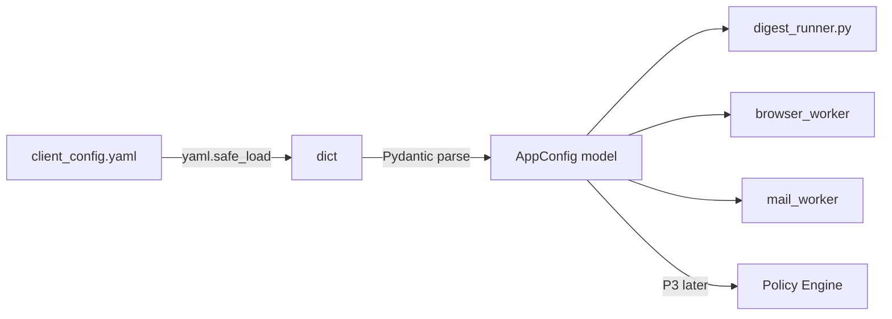

# V2 Phase 1 — Pydantic Config Validation

> **References:**
> - `docs/V2-Implementation-Plan.md` — phase overview and dependency graph
> - `docs/roadmap.md` — version scope and architecture (PicoClaw is the UI layer)
> - `docs/CLIENT_CONFIG_TEMPLATE.md` — YAML schema definition
> - `client_config.yaml` — current config file
> - `digest_runner.py` — standalone consumer of config (fallback orchestrator)
> - `services/mail_worker/app.py`, `services/browser_worker/app.py` — FastAPI
>   endpoints that PicoClaw calls; config feeds into these services

## Goal

Replace raw `yaml.safe_load()` + dict key access with validated Pydantic models.
Fail fast on startup with clear validation errors before launching workers or
browser sessions.

## Why this is Phase 1

Every subsequent V2 phase depends on typed config models:
- P2 (action log) references `client_id` from config
- P3 (policy engine) defines `PolicyConfig` in the same `config/` package
- P6 (MCP) reads service ports and paths from config

---

## Data flow



---

## Tasks

### TDD: Write tests first (`config/tests/test_config.py`)

- [x] Create `config/tests/__init__.py`
- [x] Create `config/tests/test_config.py` with these test cases:

```
test_valid_config_parses — full valid YAML → AppConfig with correct field values
test_minimal_config_parses — only required fields → defaults applied
test_missing_client_id_raises — client without 'id' → ValidationError
test_empty_clients_is_valid — clients: [] → valid AppConfig with empty list
test_unknown_fields_ignored — extra YAML keys → no error (Pydantic model_config)
test_jira_config_optional — client without jira key → jira is None
test_ado_config_optional — client without ado key → ado is None
test_load_config_from_file — load_config() reads actual client_config.yaml
test_load_config_missing_file — load_config("nonexistent.yaml") → FileNotFoundError
```

### Implement models (`config/client_config.py`)

- [x] Create `config/__init__.py` with `load_config()` function
- [x] Create `config/client_config.py` with Pydantic models:

```python
class BrowserDefaults(BaseModel)    # slow_mo_ms, navigation_timeout_ms, action_timeout_ms
class SafetyDefaults(BaseModel)     # mode, overnight_read_only, allowed_hours
class Defaults(BaseModel)           # browser, safety
class UiUrl(BaseModel)              # name, url
class DigestConfig(BaseModel)       # ui_urls
class JiraConfig(BaseModel)         # base_url, digest
class AdoConfig(BaseModel)          # org_url, project, team, digest
class MailConfig(BaseModel)         # provider, folders
class ReportingConfig(BaseModel)    # output_subdir
class PathsConfig(BaseModel)        # profiles_root, runs_root, traces_root
class ClientConfig(BaseModel)       # id, display_name, notes, jira?, ado?, reporting?
class AppConfig(BaseModel)          # version, paths, defaults, mail, clients
```

Models must match the schema in `docs/CLIENT_CONFIG_TEMPLATE.md` exactly.

### Update `digest_runner.py`

- [x] Replace `yaml.safe_load(f)` + dict access with `load_config()`
- [x] Access fields as typed attributes: `client.jira.digest.ui_urls`
- [x] Remove defensive `.get()` chains — Pydantic handles defaults and validation
- [x] Config validation errors now surface before any worker is initialized

### Run tests and verify

- [x] All new tests pass: `pytest config/tests/ -v` — 16 passed
- [x] Existing integration tests still pass: `pytest tests/test_integration.py -v` — 5 passed
- [x] Lint: `ruff check config/ digest_runner.py` — all checks passed
- [x] Import works: `python -c "from config import load_config; print('PASS')"` — PASS
- [x] Full suite: 45 passed

---

## Verify — Phase 1

```bash
python -c "from config import load_config; c = load_config(); print(f'PASS: {len(c.clients)} clients')"
pytest config/tests/ -v
pytest tests/test_integration.py -v   # V1 integration tests still pass
ruff check config/ digest_runner.py
```
