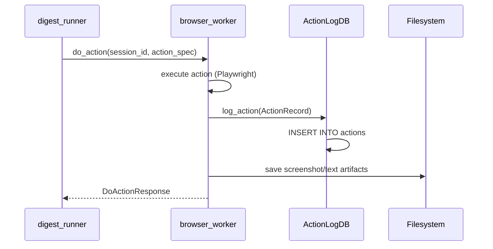

# V2 Phase 2 — SQLite Action Log

> **References:**
> - `docs/V2-Implementation-Plan.md` — phase overview, data flow diagram
> - `docs/V2-P1-Implementation.md` — config models (dependency)
> - `docs/roadmap.md` — V2 scope and architecture (PicoClaw calls FastAPI endpoints)
> - `AGENTS.md` § Safety rules — all actions produce logs with `action_id`
> - `services/mail_worker/app.py`, `services/browser_worker/app.py` — FastAPI
>   endpoints where action logging will be wired in

## Goal

Persist every action (read and write) to a local SQLite database. This replaces
the implicit "log by side effect" approach (markdown output = audit trail) with
an explicit, queryable action log that also serves as the approval queue for P4.

## Dependencies

- **P1 (config validation):** `AppConfig` provides `paths.traces_root` and client
  IDs used in action records. Config must be loaded via Pydantic before DB init.

---

## Sequence: action execution with logging



---

## Schema

```sql
CREATE TABLE IF NOT EXISTS actions (
    action_id   TEXT PRIMARY KEY,
    timestamp   TEXT NOT NULL,           -- ISO 8601
    action_type TEXT NOT NULL,           -- "jira_capture", "mail_list_unread", etc.
    client_id   TEXT NOT NULL,
    params      TEXT NOT NULL DEFAULT '{}',  -- JSON
    status      TEXT NOT NULL,           -- "completed"|"failed"|"pending_approval"|"approved"|"rejected"
    result      TEXT NOT NULL DEFAULT '{}',  -- JSON
    error       TEXT,
    approval_token TEXT
);

CREATE INDEX IF NOT EXISTS idx_actions_status ON actions(status);
CREATE INDEX IF NOT EXISTS idx_actions_client ON actions(client_id);
CREATE INDEX IF NOT EXISTS idx_actions_timestamp ON actions(timestamp);
```

---

## Tasks

### TDD: Write tests first (`services/action_log/tests/test_action_log.py`)

- [x] Create `services/action_log/__init__.py`, `services/action_log/tests/__init__.py`
- [x] Create test file with these cases:

```
test_init_creates_tables — ActionLogDB.init() creates actions table
test_log_action_and_query_by_id — log one record, query back by action_id
test_query_by_client_id — log 3 records (2 clients), query filters correctly
test_query_by_status — log records with different statuses, filter works
test_query_by_date_range — log records across dates, since filter works
test_query_with_limit — log 10 records, limit=3 returns 3
test_update_status — log as pending_approval, update to approved, verify
test_get_pending_approvals — log mixed statuses, get_pending returns only pending
test_duplicate_action_id_raises — inserting same action_id twice → IntegrityError
test_empty_query_returns_empty_list — query on fresh DB returns []
```

### Integration test: action log + config

- [x] Test that `ActionRecord.client_id` values match `AppConfig.clients[].id`
  (load real `client_config.yaml`, create records with matching client IDs)

### Implement models (`services/action_log/models.py`)

- [x] `ActionRecord` — action_id, timestamp, action_type, client_id, params, status, result, error, approval_token
- [x] `ActionQuery` — client_id?, action_type?, status?, since?, limit

### Implement DB (`services/action_log/db.py`)

- [x] `ActionLogDB.__init__(db_path)` — default `data/picoassist.db`
- [x] `ActionLogDB.init()` — create tables (idempotent)
- [x] `ActionLogDB.log_action(record)` — INSERT
- [x] `ActionLogDB.update_status(action_id, status, **kwargs)` — UPDATE
- [x] `ActionLogDB.query(q)` — SELECT with filters
- [x] `ActionLogDB.get_pending_approvals()` — shortcut for status=pending_approval
- [x] `ActionLogDB.close()` — close connection

### Wire into workers

- [x] Update `browser_worker/actions/__init__.py` `execute_action()` to accept
  optional `ActionLogDB` parameter and log after each action
- [x] Update `digest_runner.py` to initialize `ActionLogDB`, pass to `BrowserManager`
- [x] Add `data/*.db` to `.gitignore`

### Run tests and verify

- [x] All new tests pass: `pytest services/action_log/tests/ -v` — 11 passed
- [x] Integration tests pass: `pytest tests/test_integration.py -v` — 5 passed
- [x] Lint: `ruff check services/action_log/` — clean
- [x] Import: `python -c "from services.action_log import ActionLogDB; print('PASS')"` — PASS
- [x] Full suite: 67 passed

---

## Verify — Phase 2

```bash
python -c "from services.action_log import ActionLogDB; print('PASS')"
pytest services/action_log/tests/ -v
pytest tests/test_integration.py -v
ruff check services/action_log/ digest_runner.py
```
