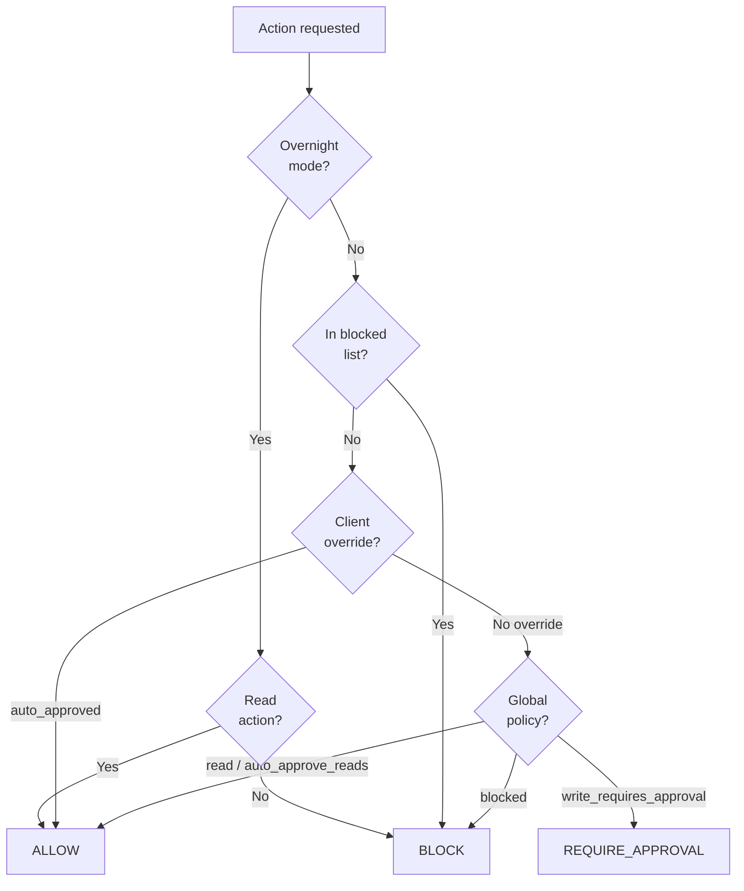

# V2 Phase 3 — Policy Engine

> **References:**
> - `docs/V2-Implementation-Plan.md` — phase overview, cross-phase interactions
> - `docs/V2-P1-Implementation.md` — config package (models live here)
> - `docs/CLIENT_CONFIG_TEMPLATE.md` § "v2 write actions" — policy schema sketch
> - `AGENTS.md` § Safety rules — non-negotiable constraints
> - `docs/PROJECT_REVIEW_REPORT.md` § Security — scope documentation
> - `docs/roadmap.md` § Architecture — dual-layer safety: PicoClaw sandbox (OS)
>   + PicoAssist policy engine (data). Policy decisions are enforced at the
>   FastAPI endpoint layer so they apply regardless of caller (PicoClaw, direct
>   curl, digest_runner, future MCP clients).

## Goal

Extract safety rules from `client_config.yaml` into a dedicated `policy.yaml` and
implement a `PolicyEngine` that evaluates whether an action is `allow`,
`require_approval`, or `block`. This is the gatekeeper for all actions — reads
pass through, writes require approval, dangerous actions are blocked.

## Dependencies

- **P1 (config validation):** `PolicyConfig` is a Pydantic model in the `config/`
  package alongside `AppConfig`.

## Interaction with P4

The policy engine **decides**; the approval engine (P4) **enforces**.
`PolicyEngine.evaluate()` returns a verdict. The caller (action registry or MCP
server) acts on it — if `require_approval`, it delegates to the approval engine.

---

## Decision flow



---

## `policy.yaml` schema

```yaml
version: 1

global:
  overnight_mode: read_only
  overnight_hours: ["00:00-06:00"]

  actions:
    read:
      - jira_open
      - jira_search
      - jira_capture
      - ado_open
      - ado_search
      - ado_capture
      - mail_list_unread
      - mail_get_thread
    write_requires_approval:
      - jira_add_comment        # V3 — not implemented yet, but policy is ready
      - jira_transition          # V3
      - ado_update_field         # V3
      - mail_move
      - mail_draft_reply
    blocked:
      - mail_send               # permanently blocked until V3
      - mail_delete             # permanently blocked

  approval:
    token_ttl_minutes: 30
    auto_approve_reads: true

clients:
  clientA:
    actions:
      write_auto_approved:
        - mail_move             # clientA allows move without approval
```

---

## Tasks

### TDD: Write tests first (`config/tests/test_policy.py`)

- [x] Add test cases to `config/tests/`:

```
test_read_action_allowed — jira_capture → "allow"
test_write_action_requires_approval — mail_move (no client override) → "require_approval"
test_blocked_action_blocked — mail_send → "block"
test_blocked_action_mail_delete — mail_delete → "block"
test_overnight_blocks_writes — jira_add_comment during overnight → "block"
test_overnight_allows_reads — jira_capture during overnight → "allow"
test_client_override_auto_approves — clientA + mail_move → "allow"
test_client_override_not_applied_to_other_clients — clientB + mail_move → "require_approval"
test_unknown_action_blocked — unknown_action → "block"
test_auto_approve_reads_setting — read action always "allow" regardless of other settings
```

### Integration test: policy + config

- [x] Load both `client_config.yaml` and `policy.yaml`, verify client IDs referenced
  in policy exist in config (cross-validation)

### Implement Pydantic models (`config/policy.py`)

- [x] `GlobalActions` — read, write_requires_approval, blocked lists
- [x] `ApprovalSettings` — token_ttl_minutes, auto_approve_reads
- [x] `GlobalPolicy` — overnight_mode, overnight_hours, actions, approval
- [x] `ClientPolicyOverride` — actions.write_auto_approved
- [x] `PolicyConfig` — version, global (alias), clients

### Implement `PolicyEngine` (in `config/policy.py`)

- [x] `PolicyEngine.__init__(policy: PolicyConfig)`
- [x] `PolicyEngine.evaluate(action: str, client_id: str, is_overnight: bool) -> str`
  - Returns `"allow"` | `"require_approval"` | `"block"`
  - Logic follows the decision flowchart above
- [x] `PolicyEngine.is_overnight(hour: int) -> bool` — check against overnight_hours

### Create `policy.yaml` in repo root

- [x] Write the policy file matching the schema above
- [x] Ensure it is committed (not gitignored)

### Update `config/__init__.py`

- [x] Add `load_policy(path)` function alongside existing `load_config()`

### Wire into action registry

- [x] Update `browser_worker/actions/__init__.py` to accept `PolicyEngine` parameter
- [x] Consult `policy_engine.evaluate()` before executing any action
- [x] For now, `require_approval` actions are logged but executed (P4 will add the
  approval gate). Add a `# TODO P4: gate on approval` comment. ✓

### Run tests and verify

- [x] All policy tests pass: `pytest config/tests/test_policy.py -v` — 11 passed
- [x] All config tests still pass: `pytest config/tests/ -v` — 22 passed
- [x] Browser worker tests still pass: `pytest services/browser_worker/tests/ -v` — 7 passed
- [x] Integration tests pass: `pytest tests/test_integration.py -v` — 5 passed
- [x] Lint: `ruff check config/ services/browser_worker/` — clean
- [x] Full suite: 67 passed

---

## Verify — Phase 3

```bash
python -c "from config.policy import PolicyEngine; print('PASS')"
pytest config/tests/ -v
pytest services/browser_worker/tests/ -v
pytest tests/test_integration.py -v
ruff check config/ services/browser_worker/ policy.yaml
```
