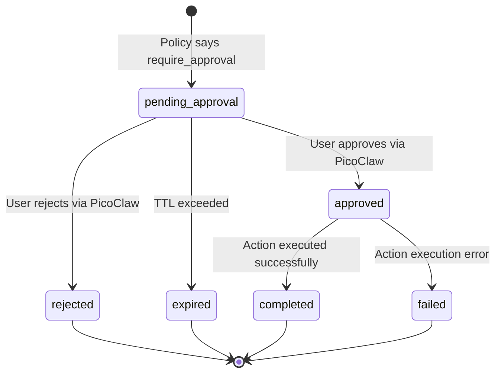
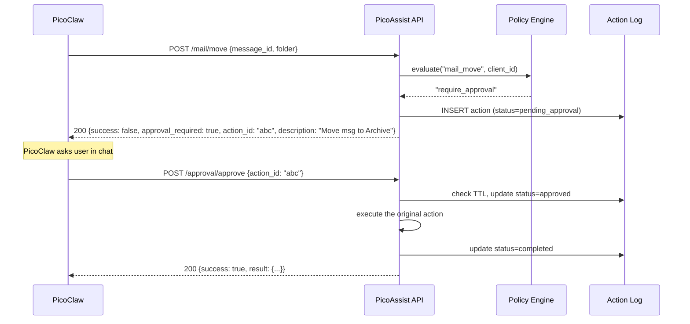

# V2 Phase 4 — Approval Workflow

> **References:**
> - `docs/V2-Implementation-Plan.md` — data flow sequence diagram showing full
>   approval round-trip through PicoClaw
> - `docs/V2-P2-Implementation.md` — action log (dependency: stores pending approvals)
> - `docs/V2-P3-Implementation.md` — policy engine (dependency: decides require_approval)
> - `docs/roadmap.md` § Architecture — PicoClaw is the UI; no custom approval CLI
> - `docs/picoclaw-tools-configuration.md` § Approval Tool — PicoClaw's built-in
>   approval system (complementary, not overlapping)
> - `AGENTS.md` § Safety rules — non-negotiable constraints

## Goal

Implement HTTP endpoints for approving and rejecting pending actions. When the
policy engine returns `require_approval`, the action is logged as pending in SQLite
and the API response tells the caller (PicoClaw) that approval is needed. PicoClaw
surfaces this to the user in conversation and calls the approval endpoint if the
user agrees.

**There is no custom approval CLI.** PicoClaw IS the approval interface.

## Dependencies

- **P2 (action log):** Pending approvals are stored as `ActionRecord` rows with
  `status="pending_approval"` in SQLite. The approval engine reads/writes these.
- **P3 (policy engine):** The `PolicyEngine.evaluate()` return value drives whether
  an action enters the approval flow.

---

## Approval state machine



---

## Approval sequence (PicoClaw as broker)



---

## Tasks

### TDD: Write tests first

- [ ] Create `services/mail_worker/tests/test_approval.py` (approval via mail endpoints):

```
test_move_requires_approval — POST /mail/move returns approval_required when policy says so
test_move_after_approval — approve action_id, re-check it executed
test_move_approval_expired — approve after TTL → 410 Gone
test_move_rejection — reject action_id → status becomes rejected
test_list_pending — GET /approval/pending returns pending items
test_read_action_no_approval — POST /mail/list_unread never requires approval
test_blocked_action_returns_403 — POST with blocked action → 403
```

- [ ] Create integration test: full round-trip (policy eval → pending → approve → execute)
  using real P2 action log (not mocked) and real P3 policy engine (not mocked)

### Implement approval HTTP endpoints

Add to `services/mail_worker/app.py` and `services/browser_worker/app.py`:

- [ ] `POST /approval/approve` — approve a pending action by action_id
  - Validates action_id exists and is pending
  - Checks TTL (from policy `token_ttl_minutes`)
  - Executes the original action
  - Updates status to completed/failed
  - Returns the action result

- [ ] `POST /approval/reject` — reject a pending action
  - Updates status to rejected
  - Returns confirmation

- [ ] `GET /approval/pending` — list all pending approvals
  - Returns list of pending actions with description, params, created_at, expires_at

- [ ] `POST /approval/expire` — expire stale approvals (called by background task or on-demand)

### Implement approval response in action endpoints

- [ ] Update `POST /mail/move` and `POST /mail/draft_reply` to:
  1. Consult policy engine
  2. If `require_approval`: log pending action, return `{approval_required: true, action_id, description}`
  3. If `allow`: execute immediately, log completed
  4. If `block`: return 403

- [ ] Update `POST /browser/do` with same pattern

### Implement action serialization for deferred execution

- [ ] Store full action parameters in SQLite so the action can be re-executed after approval
- [ ] The approval endpoint deserializes params and calls the original handler

### Wire TTL from policy

- [ ] Read `token_ttl_minutes` from `policy.yaml` global.approval section
- [ ] Approval endpoint checks `created_at + ttl > now` before approving

### Run tests and verify

- [ ] Approval tests pass: `pytest services/mail_worker/tests/test_approval.py -v`
- [ ] Integration test passes with real action log + policy engine (no mocks for P2/P3)
- [ ] All existing tests still pass: `pytest -v`
- [ ] Lint: `ruff check services/ config/`

---

## Verify — Phase 4

```bash
# Approval endpoints exist
curl -s http://localhost:8001/approval/pending | python -m json.tool
curl -s http://localhost:8002/approval/pending | python -m json.tool

# Full test suite
pytest -v

# Lint
ruff check services/ config/
```
