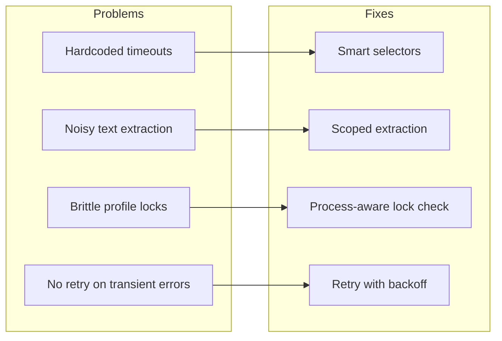

# V2 Phase 5 — Playwright Stability Improvements

> **References:**
> - `docs/V2-Implementation-Plan.md` — phase dependency graph (P5 is independent)
> - `docs/PROJECT_REVIEW_REPORT.md` — identified issues: hardcoded timeouts, noisy
>   text extraction, brittle profile locks
> - `services/browser_worker/actions/jira.py` — current Jira action handlers
> - `services/browser_worker/actions/ado.py` — current ADO action handlers
> - `services/browser_worker/playwright_runner.py` — BrowserManager with lock handling

## Goal

Address stability issues identified in the project review. These changes make
browser_worker reliable enough for PicoClaw to call without unexpected failures
or noisy output that wastes LLM context tokens.

## Dependencies

None — P5 is independent of P1–P4 and can be developed in parallel.
However, P6 (PicoClaw skill) benefits from stable API responses.

---

## Problem → fix mapping



---

## Tasks

### TDD: Write tests first

- [ ] Add to `services/browser_worker/tests/test_browser.py`:

```
test_jira_capture_waits_for_selector — mock page.wait_for_selector called, not wait_for_timeout
test_ado_capture_waits_for_selector — same for ADO
test_jira_capture_scoped_text — inner_text called with scoped selector, not "body"
test_ado_capture_scoped_text — same for ADO
test_retry_succeeds_on_second_attempt — action fails once (TimeoutError), retried, succeeds
test_retry_exhausted_raises — action fails N+1 times, original error raised
test_lock_check_dead_process_cleans_up — SingletonLock exists but process is dead → lock removed, session starts
test_lock_check_live_process_raises — SingletonLock exists and process alive → clear error message
```

### 5.1 Replace `wait_for_timeout` with `wait_for_selector`

- [ ] `actions/jira.py` — `jira_search`: wait for `[role="main"]` or `.issue-list` visible
- [ ] `actions/jira.py` — `jira_capture`: wait for `[role="main"]` or `#jira-frontend` visible
- [ ] `actions/ado.py` — `ado_search`: wait for `.work-items-hub` or `[role="main"]` visible
- [ ] `actions/ado.py` — `ado_capture`: wait for `.work-item-form` or `[role="main"]` visible
- [ ] Keep a fallback timeout (e.g., `timeout=15000`) in wait_for_selector, not a fixed sleep

### 5.2 Scope text extraction

- [ ] `actions/jira.py` — `jira_capture`: replace `page.inner_text("body")` with
  `page.inner_text('[role="main"]')` (already done in `jira_search`, extend)
- [ ] `actions/ado.py` — `ado_capture`: use `page.inner_text('[role="main"]')` or
  `.work-item-form` content wrapper
- [ ] Truncate extracted text to 4000 chars (saves LLM context when PicoClaw reads it)

### 5.3 Retry logic for transient failures

- [ ] Create utility function in `services/browser_worker/playwright_runner.py`:
  ```python
  async def with_retry(fn, retries=2, backoff=2.0):
      for attempt in range(retries + 1):
          try:
              return await fn()
          except (TimeoutError, PlaywrightError) as e:
              if attempt == retries:
                  raise
              await asyncio.sleep(backoff * (attempt + 1))
  ```
- [ ] Wrap action handler calls in `do_action()` with retry
- [ ] Only retry on transient errors (timeout, network). Don't retry on selector not found.

### 5.4 Safe profile lock handling

- [ ] Add `psutil` to `pyproject.toml` dependencies (or use `os` + process check)
- [ ] Replace forceful `lock_file.unlink()` with:
  1. Read PID from `SingletonLock` file
  2. Check if process with that PID is alive
  3. If dead → remove lock, proceed
  4. If alive → raise clear error: "Browser profile is in use by PID {pid}. Close the browser first."
- [ ] Log warning when cleaning up dead lock

### Run tests and verify

- [ ] All browser worker tests pass: `pytest services/browser_worker/tests/ -v`
- [ ] Integration tests pass: `pytest tests/test_integration.py -v`
- [ ] Lint: `ruff check services/browser_worker/`

---

## Verify — Phase 5

```bash
pytest services/browser_worker/tests/ -v
pytest tests/test_integration.py -v
ruff check services/browser_worker/
```
