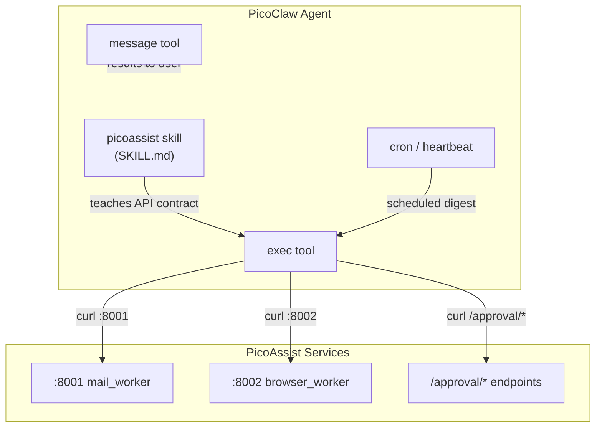

# V2 Phase 6 — PicoClaw Skill + Setup

> **References:**
> - `docs/V2-Implementation-Plan.md` — architecture diagram, data flow sequence
> - `docs/roadmap.md` § Architecture — PicoClaw is the UI, PicoAssist is the tool backend
> - `docs/picoclaw-skill-format.md` — how to author PicoClaw skills (SKILL.md format)
> - `docs/picoclaw-tools-configuration.md` — PicoClaw's built-in tools and config
> - `PicoClaw-README.md` — PicoClaw installation, config, CLI reference
> - `docs/V2-P4-Implementation.md` — approval endpoints the skill calls
> - `services/mail_worker/app.py` — mail API endpoints (port 8001)
> - `services/browser_worker/app.py` — browser API endpoints (port 8002)

## Goal

Create a PicoClaw skill that teaches the agent how to use PicoAssist's HTTP APIs.
Configure PicoClaw's heartbeat for scheduled digests. Provide setup instructions
so a user can go from PicoClaw installed to "ask PicoClaw to triage my email."

## Dependencies

- **P4 (approval):** The skill documents approval endpoints and the approval flow.
- **P5 (Playwright stability):** Stable browser_worker responses for reliable skill usage.

---

## How PicoClaw uses PicoAssist



---

## Tasks

### 6.1 Create the PicoClaw skill

- [ ] Create `picoclaw/skills/picoassist/SKILL.md`

The skill follows PicoClaw's standard format:

```yaml
---
name: picoassist
description: "Personal PM assistant for email triage, Jira/ADO monitoring, and
  daily digests. Use when the user asks about email, Jira issues, ADO work items,
  or daily digest reports. Calls PicoAssist HTTP APIs on localhost:8001 (email)
  and localhost:8002 (browser automation)."
---
```

Body teaches the agent:
- **Prerequisites:** PicoAssist services must be running on 8001/8002
- **Email operations:** How to call each mail endpoint with curl
- **Browser operations:** How to start sessions, capture pages, stop sessions
- **Digest:** How to run a full digest via the API or `python digest_runner.py`
- **Approval flow:** What to do when a response contains `approval_required: true`
- **Safety rules:** What's blocked, what needs approval, what's allowed

### 6.2 Create API reference

- [ ] Create `picoclaw/skills/picoassist/references/api-reference.md`

Detailed endpoint reference the agent loads on demand:

```markdown
## Mail Worker (port 8001)

### POST /mail/list_unread
Request: {"folder": "Inbox", "max_results": 25}
Response: {"emails": [...], "count": N}

### POST /mail/get_thread_summary
Request: {"message_id": "..."}
Response: {"subject": "...", "messages": [...], "participant_count": N}

### POST /mail/move
Request: {"message_id": "...", "folder_name": "Archive"}
Response: {"success": true, "new_folder": "...", "action_id": "..."} or
          {"approval_required": true, "action_id": "...", "description": "..."}

### POST /mail/draft_reply
Request: {"message_id": "...", "tone": "professional", "bullets": ["...", "..."]}
Response: {"draft_id": "...", "subject": "...", "body_preview": "...", "action_id": "..."}

## Browser Worker (port 8002)

### POST /browser/start_session
Request: {"client_id": "clientA", "app": "jira"}
Response: {"session_id": "...", "client_id": "...", "app": "...", "profile_path": "..."}

### POST /browser/do
Request: {"session_id": "...", "action_spec": {"action": "jira_capture", "params": {"url": "..."}}}
Response: {"success": true, "action_id": "...", "result": {...}, "artifacts": [...]}

### POST /browser/screenshot
Request: {"session_id": "..."}
Response: {"path": "...", "timestamp": "..."}

### POST /browser/stop_session
Request: {"session_id": "..."}
Response: {"success": true, "session_id": "..."}

## Approval (both ports)

### GET /approval/pending
Response: [{"action_id": "...", "action_type": "...", "description": "...", "expires_at": "..."}]

### POST /approval/approve
Request: {"action_id": "..."}
Response: {original action result}

### POST /approval/reject
Request: {"action_id": "..."}
Response: {"action_id": "...", "status": "rejected"}

## Health

### GET /health (8001)
Response: {"status": "ok", "auth": "ready"|"needs_device_code"}

### GET /health (8002)
Response: {"status": "ok", "active_sessions": N}
```

### 6.3 Create PicoClaw heartbeat config

- [ ] Create `picoclaw/HEARTBEAT.md`

```markdown
# PicoAssist Periodic Tasks

## Quick Tasks
- Check PicoAssist services are healthy (curl localhost:8001/health and :8002/health)

## Long Tasks (use spawn for async)
- Run daily email digest: curl -X POST localhost:8001/mail/list_unread and summarize
```

### 6.4 Create PicoClaw config snippet

- [ ] Create `picoclaw/setup.md` — instructions for configuring PicoClaw to use PicoAssist

Contents:
1. Install PicoClaw (binary download or `go install`)
2. Run `picoclaw onboard`
3. Copy `picoclaw/skills/picoassist/` to `~/.picoclaw/workspace/skills/picoassist/`
4. Copy `picoclaw/HEARTBEAT.md` to `~/.picoclaw/workspace/HEARTBEAT.md`
5. Configure cron for daily digest (optional):
   ```
   picoclaw cron add "0 6 * * *" "Run PicoAssist daily digest for all clients"
   ```
6. Start PicoAssist services:
   ```
   python -m services.mail_worker.app &
   python -m services.browser_worker.app &
   ```
7. Test: `picoclaw agent -m "Check PicoAssist health"`

### 6.5 Create startup helper script

- [ ] Create `scripts/start_services.ps1`

```powershell
# Start PicoAssist FastAPI services in background
$envFile = Join-Path $PSScriptRoot ".." ".env"
if (Test-Path $envFile) {
    Get-Content $envFile | ForEach-Object {
        if ($_ -match '^\s*([^#][^=]+)=(.*)$') {
            [Environment]::SetEnvironmentVariable($matches[1].Trim(), $matches[2].Trim(), "Process")
        }
    }
}

$repoRoot = Split-Path $PSScriptRoot -Parent
Start-Process python -ArgumentList "-m services.mail_worker.app" -WorkingDirectory $repoRoot -NoNewWindow
Start-Process python -ArgumentList "-m services.browser_worker.app" -WorkingDirectory $repoRoot -NoNewWindow
Write-Host "PicoAssist services starting on ports 8001 and 8002..."
Start-Sleep -Seconds 3
Invoke-RestMethod http://localhost:8001/health | ConvertTo-Json
Invoke-RestMethod http://localhost:8002/health | ConvertTo-Json
```

### 6.6 Tests

Testing the skill itself doesn't require pytest — it's a markdown file. But test that:

- [ ] PicoAssist services start and respond to health checks
- [ ] Skill file parses correctly (valid YAML frontmatter)
- [ ] API reference matches actual endpoint signatures (compare with app.py routes)

Add to `tests/test_integration.py`:

```
test_skill_frontmatter_valid — parse SKILL.md, verify name and description present
test_api_reference_matches_endpoints — compare documented endpoints against FastAPI routes
test_services_health_check — (mark as @pytest.mark.live) start services, check /health
```

### Run tests and verify

- [ ] Integration tests pass: `pytest tests/test_integration.py -v`
- [ ] Lint: `ruff check .`
- [ ] PicoClaw loads skill: `picoclaw agent -m "list your skills"` shows picoassist
- [ ] End-to-end: `picoclaw agent -m "check PicoAssist health"` returns ok from both services

---

## Verify — Phase 6

```bash
# Skill file exists with valid frontmatter
python -c "
import yaml
content = open('picoclaw/skills/picoassist/SKILL.md').read()
fm = content.split('---')[1]
meta = yaml.safe_load(fm)
assert meta['name'] == 'picoassist'
assert 'description' in meta
print('PASS: skill frontmatter valid')
"

# Services start and respond
pwsh scripts/start_services.ps1

# PicoClaw sees the skill (after copying to workspace)
picoclaw agent -m "What skills do you have?"

# Full test suite
pytest -v
ruff check .
```
